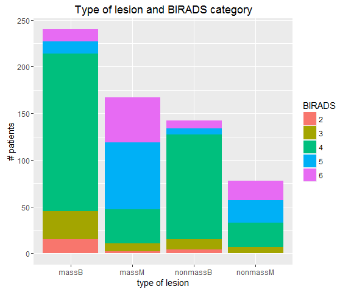
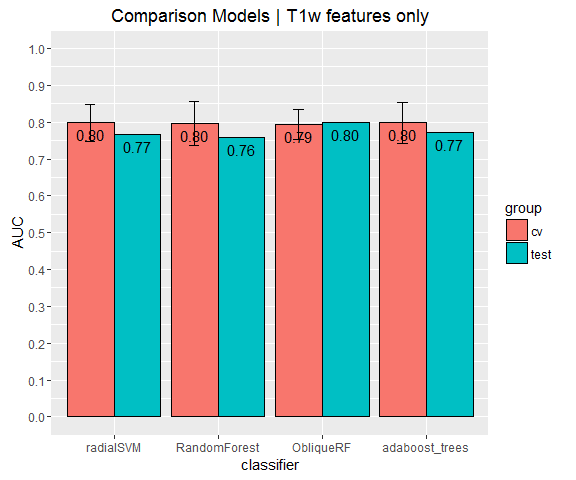
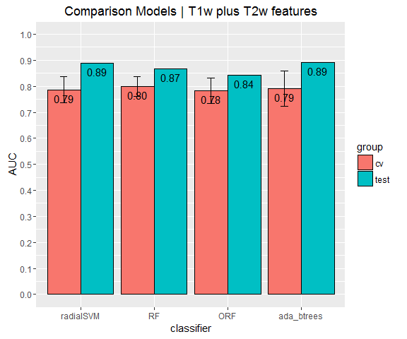
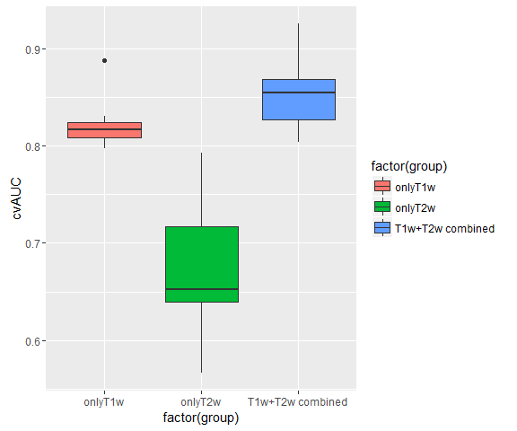
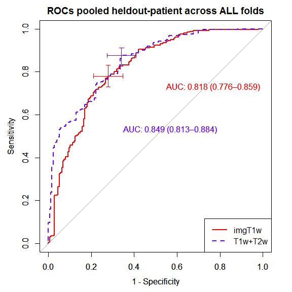
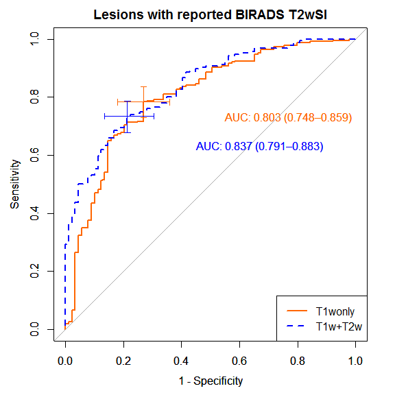
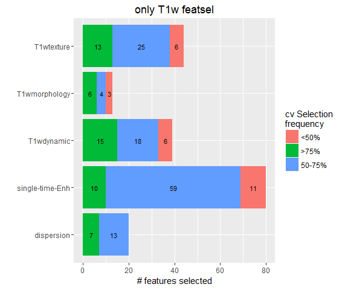
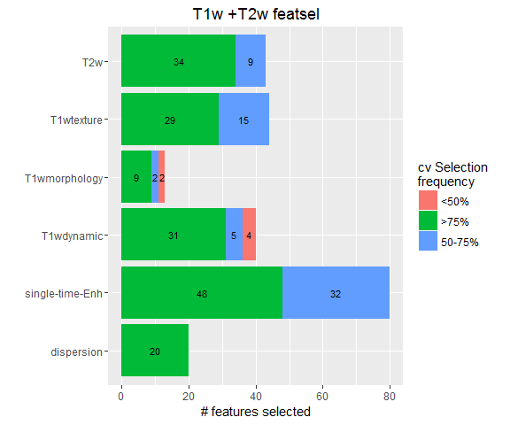

# Notes new paper


# Incorporating T2w breast MRI in CADx of breast lesions:

## Rationale
* While T1w CE-MRI plays a central role in breast MRI, T2w imaging is routinely used by radiologists to rule out the presence of cysts, intra mammary lymph nodes and other benign findings (Kuhl et al., 1999; Moran et al., 2014), yet T2w-derived lesion features have been scarcely used in CAD. 
* Baltzer et al. (2011) showed that in the presence of dilated ducts and cysts, the signal intensity on T2w images differed significantly between cancers and non-cancers. Ballesio et al. (2009) proposed to use the lesion to muscle
signal intensity ratio (LMSIR) as an adjunt lesion feature to the standard MRI interpreting criteria, and showed that LMSIR measurement improved the differential diagnosis of borderline BIRADS 3 and 4 lesions. 
* In addition, T2w morphology and texture could act as additional differentiating criteria for benign lesions such as fibroadenomas that can exhibit similar constrast agent enhancement as malignant lesions (Baltzer et al. (2011))

## Aim
To investigate whether we can obtain an increase in discrimination ability for the classification task of cancerous and non-cancerous lesions using T2w imaging derived features in addition to more conventional T1w CE-MRI based-features


## Materials:
### Breast MRI datasets
* 627 breast MRI lesions
* in 435 women aged 48.75 $\pm$ 10.6 years (mean $\pm$ std)
* breakdown by enhancement type and ground truth pathology:


```r
summary(allfeatures$origlesion_label)
```

```
   massB    massM nonmassB nonmassM 
     240      167      142       78 
```
* Distribution of lesion enhancement type by radiologist BIRADS assessment category

```r
bartypes <- ggplot(patientinfo, aes(type, fill = BIRADS))
bartypes + geom_bar() + labs(x = "type of lesion", y = "# patients", title = "Type of lesion and BIRADS category")
```

<!-- -->


## Experiment 1: Comparing Ensemble of trees with other models (not for paper)
How does the type of classifier affect the generalization error ?

Compare differences in cross-validation and generalization performance among 4 types of predictive classifiers:

1. **SVM** (radial bases - based on Levman. et al IEEE paper))

2. **Random Forest** (standard bootstrap aggregation of binary decision trees in ensembles, as originally proposed)

3. **Oblique Random Forest** (allowing higher order feature interactions during node splits)

4. **Ensembles of boosting classification trees** (binary decision trees - build ensembles by error weight estimation instead of majority voting)


**Cross validation AUC (cv):**

AUC measured in the Training set during grid parameter tunning. For each classifier, parameters are tunned acording to a grid search using the following algorithm:


**Generalizaton AUC (test): **

AUC measured in the Test set, after parameter tunning, using best set of parameters in final model 

After running 10 folds of cross-validation (cv), below is the cv AUC on 90\% datasets (used for training and parameter tunning) and the remaining 10\% held-out datasets for independent testing.


The AUC ROC for classifiers using *only T1w features* is: 

```
        AUC        std group     classifier
1 0.7984671 0.04996057    cv      radialSVM
2 0.7664474 0.00000000  test      radialSVM
3 0.7963950 0.06003491    cv   RandomForest
4 0.7576754 0.00000000  test   RandomForest
5 0.7932280 0.04028831    cv      ObliqueRF
6 0.7982456 0.00000000  test      ObliqueRF
7 0.7981366 0.05497980    cv adaboost_trees
8 0.7719298 0.00000000  test adaboost_trees
```

<!-- -->


The AUC ROC for classifiers using *T2w in addition to T1w features* is: 

<!-- -->

cv AUC for all classifiers is comparable, but SVMs and ensembles of boosting classification trees exhibit higher generalization performance tahn bagging ensembles of classification trees. 

## Experiment 2: Boosting ensembles of trees with additional T2w features 
* The premise of Ensembles learning is simple: The goal is to improve the accuracy of any classifier by combining single classifiers  which are slightly better than random guessing into a "committee". Every single trained classifier has limitations and on its own will produce classification errors, but the decision of the "committee" has better overall accuracy on average, than any individual classifier

* In Boosting (Frend & Schapire 1996) the idea is to build individual classifiers that exhibit "diversity" by explicitly altering the distribution of training examples. Adaboost trains models sequentially and identifies miss-classified cases so that their emphasis is increased to correctly classify them in subsequent rounds.
 
* **Intuition:** Any weak classifier can be boosted into an arbitrarily accurate one. In principle, a decision tree algorithm, can grow each branch of the tree deeply enough to perfectly classify the training examples, but in noisy data or in small training sets this practice is prone to overfitting.

The following algorithm is used to boost ensembles of classification trees:


* Parameters such as **maximum depth** of binary decision trees, and the **number of boosting trees** in the ensemble can be tunned. The combination of parameters that produced the ensemble with lowest classification error was chosen as the final classifer, and its unbiased performance assessed in held-out cases using 10 folds of cv.


After running 10 folds of cross-validation (cv), below is the AUC distributions achieved on held-out test sets:

```
   Min. 1st Qu.  Median    Mean 3rd Qu.    Max. 
 0.7976  0.8083  0.8167  0.8239  0.8243  0.8879 
```

```
   Min. 1st Qu.  Median    Mean 3rd Qu.    Max. 
 0.5662  0.6399  0.6528  0.6752  0.7173  0.7927 
```

```
   Min. 1st Qu.  Median    Mean 3rd Qu.    Max. 
 0.8032  0.8268  0.8543  0.8533  0.8683  0.9253 
```

<!-- -->

### Performance of combined T1w+T2w vs. only T1w classifiers
#### in all lesions (pooled data across cv-folds and plot pooled results)

```
[1] "Results for T1w-only features classifier:"
```

```
Area under the curve: 0.8179
95% CI (2000 stratified bootstrap replicates):
 thresholds sp.low sp.median sp.high se.low se.median se.high
  0.4472048 0.6534    0.7216  0.7898 0.7308    0.7808  0.8308
```

```
[1] "Results for T1w+T2w features classifier:"
```

```
Area under the curve: 0.8489
95% CI (2000 stratified bootstrap replicates):
 thresholds sp.low sp.median sp.high se.low se.median se.high
  0.4755269 0.5909    0.6591  0.7273 0.8346    0.8769  0.9115
```

<!-- -->

**Significance t-test:**

```

	Bootstrap test for two correlated ROC curves

data:  p1all$ROC and p2all$ROC
D = -2.0336, boot.n = 2000, boot.stratified = 1, p-value = 0.021
alternative hypothesis: true difference in AUC is less than 0
sample estimates:
AUC of roc1 AUC of roc2 
  0.8179087   0.8488855 
```

#### In lesions with reported BIRADS T2w Signal intensity categories

The BIRADS lexicon defines lesion signal intensity in T2w imaging as follows:

 * **Hypointense or not seen**
 
 * **Slightly Hyperintense**
 
 * **Hyperintense**

In clinical practice, however, BIRADS T2w Signal intensity categories is **not reported** by the radiologist, suggesting that the evaluation of T2w imaging is relevant in the differential diagnosis of certain lesions
but not others. This has been previously documented in the literature, but this expert knowledge has not been incorporated in CADx. 

BIRADS T2w SI category in our datasets was reported among 315 cases, while not reported in 312:


```
           Hyperintense Hypointense or not seen                    None   Slightly hyperintense 
                     98                     152                     312                      65 
```

**ROC for Lesions with reported BIRADS T2wSI:**

```
[1] "Results for T1w-only features classifier:"
```

```
Area under the curve: 0.8034
95% CI (2000 stratified bootstrap replicates):
 thresholds sp.low sp.median sp.high se.low se.median se.high
  0.4450811 0.6404    0.7303  0.8202 0.7301    0.7832  0.8363
```

```
[1] "Results for T1w+T2w features classifier:"
```

```
Area under the curve: 0.8369
95% CI (2000 stratified bootstrap replicates):
 thresholds sp.low sp.median sp.high se.low se.median se.high
  0.4072215 0.6966    0.7865  0.8652  0.677    0.7345  0.7877
```

<!-- -->


**Significance t-test:**

```

	Bootstrap test for two correlated ROC curves

data:  p1BIRADS$ROC and p2BIRADS$ROC
D = -1.7341, boot.n = 2000, boot.stratified = 1, p-value = 0.04145
alternative hypothesis: true difference in AUC is less than 0
sample estimates:
AUC of roc1 AUC of roc2 
  0.8034454   0.8368798 
```

**ROC for Lesions without reported BIRADS T2wSI:**

```
[1] "Results for T1w-only features classifier:"
```

```
Area under the curve: 0.7968
95% CI (2000 stratified bootstrap replicates):
 thresholds sp.low sp.median sp.high se.low se.median se.high
  0.5111325 0.5449    0.6218  0.6987 0.8141    0.8718  0.9231
```

```
[1] "Results for T1w+T2w features classifier:"
```

```
Area under the curve: 0.81
95% CI (2000 stratified bootstrap replicates):
 thresholds sp.low sp.median sp.high se.low se.median se.high
  0.4677727 0.5833    0.6603  0.7308 0.7564    0.8205  0.8782
```

<!-- -->

Significance t-test:

```

	Bootstrap test for two correlated ROC curves

data:  p1noBIRADS$ROC and p2noBIRADS$ROC
D = -0.72066, boot.n = 2000, boot.stratified = 1, p-value = 0.2356
alternative hypothesis: true difference in AUC is less than 0
sample estimates:
AUC of roc1 AUC of roc2 
  0.7968236   0.8099523 
```

## Experiment 3: Assessing contribution of T2w features to classification output 
Since we are trying to measure the added effect of T2w-based features on solely T1w-based classification of lesions, is important to assess individual lesion contribution to a classification output.

A surrogate for feature contribution to prediction output is **tree-based feature relevance**. 

**tree-based feature relevance** can be measured using:

  * Permutation based (z-scores) or 
  
  * decrease in Gini impurity criterion 

Ensembles of trees are in general very randomized - when adding an extra feature to the pool, a tree will be build based on the maximum decrease in Gini available in the feature samples. By adding up the amount gini decreases for each individual variable over all trees in the ensemble and sorting those values, it's possible to identify the features that produced the highest decrease in Gini as **the most relevant features.**

To factor out the randomization effect on selected features, the **most relevant features** can be identify as those features consistenly selected across multiple resamples of the data. This is possible using a resampling technique such as cross-validation. For example, a "very relevant" feature can be defined as a feature selected in more than 75% of the resampling folds, while a "moderately relevant" feature as a feature selected in 50-to-75% of the folds.
 

### Confirming contribution of T2w features to classification output**

```
     dispersion single-time-Enh      T1wdynamic   T1wmorphology      T1wtexture 
             20              80              40              14              44 
```

<!-- -->

```
     dispersion single-time-Enh      T1wdynamic   T1wmorphology      T1wtexture             T2w 
             20              80              40              14              44              44 
```

<!-- -->


## Summary and Conclusions:

* The inclusion of T2w features improved the CAD predictive performance. AUC increased from 0.82 to 0.85 when combining T1w and T2w features during classifier ensemble training, and t-test significance difference testing in ROC space confirmed that the difference was significant (p-value = 0.021)

* When discriminating by wheather BIRADS T2wSI was reported or not by the radiologist, combining T1w and T2w features produce a significant increase in AUC only among lesions with reported BIRADS T2wSI:

* **For Reported BIRADS T2wSI:** 
  + T1w-only features classifier **AUC = 0.80, 95% CI [0.75-0.86]** vs. combined T1w and T2w features classifier **AUC = 0.84, 95% CI [0.79-0.88]**
  + t-test significance testing (true difference in AUC is less than zero i.e the AUC of roc1 is smaller than the AUC of roc2.) **p-value = 0.04**
  
* **for Not reported BIRADS T2wSI:**
  + T1w-only features classifier **AUC = 0.80, 95% CI [0.75-0.85]** vs. combined T1w and T2w features classifier **AUC = 0.81, 95% CI [0.76-0.86]**
  + t-test significance testing (true difference in AUC is less than zero) **p-value = 0.23**


* Including T2w features improved the AUC ROC performance for lesions without reported T2w BIRADS SI, but the increase was lower and not statistically significant than for lesions where the radiologist found T2w BIRADS SI relevant.

* Tree-based feature relevance analysis confirmed that T2w features contributed to the predictive outcome of T1w+T2w combined classifiers. Out of the 44 T2w features available, 43 where selected during binary decision splits. 34 features where selected with in 75% or more of the resampling folds, and 9 features in 50-to-75% of the folds, indicating the consistent use of T2w features.


